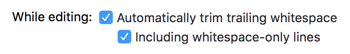
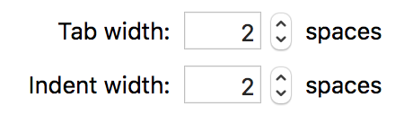

# Airbnb Swift Style Guide

## Goals

Following this style guide should:

* Make it easier to read and begin understanding unfamiliar code
* Make code easier to maintain
* Reduce simple programmer errors
* Reduce cognitive load while coding

Note that brevity is not a primary goal. Code should be made more concise only if other good code qualities (such as readability, simplicity, and clarity) remain equal or are improved.

The guidelines in the [Swift API Design Guidelines](https://swift.org/documentation/api-design-guidelines/) are highly recommended in addition to this document.

## Environment Setup

Most of the default Xcode settings are okay. The only changes are below.

##### Preferences > Text Editing > Editing:



##### Preferences > Text Editing > Indentation:



##### Preferences > Text Editing > Editing:

> Due to larger screen sizes, we have opted to choose a page guide greater than 80.


## Sections

1. [Naming](#naming)
2. [Style](#style)
3. [Patterns](#patterns)
4. [File Organization](#file-organization)
5. [Objective-C Interoperability](#objective-c-interoperability)

## Naming

* <a id='use-camel-case'></a>**Use UpperCamelCase for type and protocol names, and lowerCamelCase for everything else.** (<a href='#use-camel-case'>link</a>)

```swift
protocol SpaceThing {
  // ...
}

class Spacefleet: SpaceThing {

  enum Formation {
    // ...
  }

  class Spaceship {
    // ...
  }

  var ships: [Spaceship] = []
  static let worldName: String = "Earth"

  func add(ship: Spaceship) {
    // ...
  }
}

let myFleet = Spacefleet()
```

* <a id='underscore-backing-properties'></a>**Underscore-prefix private property names only if they are mutable private properties with a similarly named internal property.** This makes it possible to mimic the behavior of the `copying` attribute of Objective-C properties. In all other cases we can rely on our file organization and access control designations to differentiate between private and public properties and methods. (<a href='#underscore-backing-properties'>link</a>)

```swift
class Foo {

  // MARK: Lifecycle

  init() {
    _text = NSMutableString(string: "Hello")
  }

  // MARK: Internal

  var text: String {
    return _text as String
  }

  // MARK: Private

  private var _text: NSMutableString
}
```

* <a id='bool-names'></a>**Name booleans like `isSpaceship`, `hasSpacesuit`, etc.** This makes it clear that they are booleans and not other types. (<a href='#bool-names'>link</a>)

* <a id='capitalize-acronyms'></a>**Acronyms in names (e.g. `URL`) should be all-caps except when it’s the start of a name that would otherwise be lowerCamelCase, in which case it should be uniformly lower-cased.** (<a href='#capitalize-acronyms'>link</a>)

```swift
// WRONG
class UrlValidator {

  // MARK: Internal

  func isValidUrl(URL: NSURL) -> Bool {
    // ...
  }

  func isUrlReachable(URL: NSURL) -> Bool {
    // ...
  }
}

let URLValidator = UrlValidator().isValidUrl(/* some URL */)

// RIGHT
class URLValidator {

  // MARK: Internal

  func isValidURL(url: NSURL) -> Bool {
    // ...
  }

  func isURLReachable(url: NSURL) -> Bool {
    // ...
  }
}

let urlValidator = URLValidator().isValidURL(/* some URL */)
```

* <a id='general-part-first'></a>**Names should be written with their most general part first and their most specific part last.** The meaning of "most general" depends on context, but should roughly mean "that which most helps you narrow down your search for the item you're looking for." Most importantly, be consistent with how you order the parts of your name. (<a href='#general-part-first'>link</a>)

```swift
// WRONG
let rightTitleMargin: CGFloat
let leftTitleMargin: CGFloat
let bodyRightMargin: CGFloat
let bodyLeftMargin: CGFloat

// RIGHT
let titleMarginRight: CGFloat
let titleMarginLeft: CGFloat
let bodyMarginRight: CGFloat
let bodyMarginLeft: CGFloat
```

* <a id='hint-at-types'></a>**Include a hint about type in a name if it would otherwise be ambiguous.** (<a href='#hint-at-types'>link</a>)

```swift
// WRONG
let title: String
let cancel: UIButton

// RIGHT
let titleText: String
let cancelButton: UIButton
```

* <a id='past-tense-events'></a>**Event-handling functions should be named like past-tense sentences.** The subject can be omitted if it's not needed for clarity. (<a href='#past-tense-events'>link</a>)

```swift
// WRONG
class MyClass {

  // MARK: Private

  private func handleFooButtonTap() {
    // ...
  }

  private func modelChanged() {
    // ...
  }
}

// RIGHT
class MyClass {

  // MARK: Private

  private func didTapFooButton() {
    // ...
  }

  private func modelDidChange() {
    // ...
  }
}
```

* <a id='avoid-class-prefixes'></a>**Avoid Objective-C-style acronym prefixes.** This is no longer needed to avoid naming conflicts in Swift. (<a href='#avoid-class-prefixes'>link</a>)

```swift
// WRONG
class AIRAccountManager {
  // ...
}

// RIGHT
class AccountManager {
  // ...
}
```

* <a id='avoid-controller-suffix'></a>**Avoid `*Controller` in names of classes that aren't view controllers.** This helps reduce confusion about the purpose of a class. Consider `*Manager` instead. (<a href='#avoid-controller-suffix'>link</a>)

```swift
// WRONG
class AccountController {
  // ...
}

// RIGHT
class AccountManager {
  // ...
}
```

## Style

* <a id='use-implicit-types'></a>**Don't include types where they can be easily inferred.** One exception is for `CGFloat`s because they don't auto-bridge with `Double` or `Int`. (<a href='#use-implicit-types'>link</a>)

```swift
// WRONG
let something: MyClass = MyClass()

// RIGHT
let something = MyClass()
```

```swift
// WRONG
let someMargin = CGFloat(5)

// RIGHT
let someMargin: CGFloat = 5
```

```swift
enum Direction {
  case left
  case right
}

func someDirection() -> Direction {
  // WRONG
  return Direction.left

  // RIGHT
  return .left
}
```

* <a id='omit-self'></a>**Don't use `self` unless it's necessary for disambiguation or required by the language.** (<a href='#omit-self'>link</a>)

```swift
class MyClass {

  // MARK: Lifecycle

  init(aProp: Int) {
	// Okay to use self here
    self.aProp = aProp
  }

  // MARK: Internal

  var aProp: Int

  func doSomething() {
    // WRONG
    self.aProp = 4

    // RIGHT
    aProp = 4

    // WRONG
    self.otherMethod()

    // RIGHT
    otherMethod()
  }
}
```

* <a id='omit-void-return'></a>**Don’t include return type Void in blocks.** (Even though that’s what autocomplete does.) (<a href='#omit-void-return'>link</a>)

```swift
// WRONG
someAsyncThing() { argument -> Void in
  ...
}

// RIGHT
someAsyncThing() { argument in
  ...
}
```

* <a id='favor-void-return'></a>**Favor `Void` return types over `()`.** If you must specify a `Void` return type in a function declaration, use `Void` rather than `()` to improve readability. (<a href='#favor-void-return'>link</a>)

```swift
// WRONG
func method(completion: () -> ()) {
  ...
}

// RIGHT
func method(completion: () -> Void) {
  ...
}
```

* <a id='long-function-declaration'></a>**Separate [long](#environment-setup) function declarations with line breaks before each argument label.** Put the open curly brace on the next line so the first executable line doesn't look like it's another parameter. (<a href='#long-function-declaration'>link</a>)

```swift
class Universe {

  // MARK: Internal

  // WRONG
  func generateStars(at location: Point, count: Int, color: StarColor, withAverageDistance averageDistance: Float) -> String {
    // This is too long and will probably auto-wrap in a weird way
  }

  // WRONG
  func generateStars(at location: Point,
                     count: Int,
                     color: StarColor,
                     withAverageDistance averageDistance: Float) -> String
  {
    // Xcode indents all the arguments
  }

  // WRONG
  func generateStars(
    at location: Point,
    count: Int,
    color: StarColor,
    withAverageDistance averageDistance: Float) -> String {
    populateUniverse() // this line blends in with the argument list
  }

  // RIGHT
  func generateStars(
    at location: Point,
    count: Int,
    color: StarColor,
    withAverageDistance averageDistance: Float) -> String
  {
    populateUniverse()
  }
}
```

* <a id='long-function-invocation'></a>**[Long](#environment-setup) function invocations should also break on each argument.** Put the closing parenthesis on the last line of the invocation. (<a href='#long-function-invocation'>link</a>)

```swift
universe.generateStars(
  at: location,
  count: 5,
  color: starColor,
  withAverageDistance: 4)

universe.generate(
  5,
  .stars,
  at: location)
```

* <a id='multi-line-array'></a>**Multi-line arrays should have each bracket on a separate line.** Put the opening and closing brackets on separate lines from any of the elements of the array. Also add a trailing comma on the last element. (<a href='#multi-line-array'>link</a>)

```swift
// WRONG
let rowContent = [listingUrgencyDatesRowContent(),
                  listingUrgencyBookedRowContent(),
                  listingUrgencyBookedShortRowContent()]

let rowContent = [
  listingUrgencyDatesRowContent(),
  listingUrgencyBookedRowContent(),
  listingUrgencyBookedShortRowContent()
]

// RIGHT
let rowContent = [
  listingUrgencyDatesRowContent(),
  listingUrgencyBookedRowContent(),
  listingUrgencyBookedShortRowContent(),
]
```

* <a id='long-if-statement'></a>**When an `if`/`guard` statement becomes [too long](#environment-setup), start each condition with a newline, including the first.** This includes the last clause: put the opening curly brace on a new line to ensure proper indentation of the statement body. The first condition is also indented to vertically align all conditions. (<a href='#long-if-statement'>link</a>)

```swift
if
  let val1 = val1,
  let val2 = val2,
  !val2.isEmpty 
{
  print(val2)
}

guard
  let value = some,
  let value2 = someOther else 
{
  return
}
```

* <a id='name-tuple-elements'></a>**Name members of tuples for extra clarity.** Rule of thumb: if you've got more than 3 fields, you should probably be using a struct. (<a href='#name-tuple-elements'>link</a>)

```swift
// WRONG
func whatever() -> (Int, Int) {
  return (4, 4)
}
let thing = whatever()
print(thing.0)

// RIGHT
func whatever() -> (x: Int, y: Int) {
  return (x: 4, y: 4)
}

// THIS IS ALSO OKAY
func whatever2() -> (x: Int, y: Int) {
  let x = 4
  let y = 4
  return (x, y)
}

let coord = whatever()
coord.x
coord.y
```

* <a id='favor-constructors'></a>**Use constructors instead of *Make() functions for CGRect, CGPoint, NSRange and others.** (<a href='#favor-constructors'>link</a>)

```swift
// WRONG
let rect = CGRectMake(10, 10, 10, 10)

// RIGHT
let rect = CGRect(x: 0, y: 0, width: 10, height: 10)
```

* <a id='use-modern-swift-extensions'></a>**Favor modern Swift extension methods over older Objective-C global methods.** (<a href='#use-modern-swift-extensions'>link</a>)

```swift
// WRONG
var rect = CGRectZero
var width = CGRectGetWidth(rect)

// RIGHT
var rect = CGRect.zero
var width = rect.width
```

* <a id='colon-spacing'></a>**Place the colon immediately after an identifier, followed by a space.** (<a href='#colon-spacing'>link</a>)

```swift
// WRONG
var something : Int = 0

// RIGHT
var something: Int = 0
```

```swift
// WRONG
class MyClass : SuperClass {
	// ...
}

// RIGHT
class MyClass: SuperClass {
	// ...
}
```

```swift
// WRONG
var dict = [KeyType:ValueType]()
var dict = [KeyType : ValueType]()

// RIGHT
var dict = [KeyType: ValueType]()
```

* <a id='unnecessary-parens'></a>**Omit unnecessary parentheses.** (<a href='#unnecessary-parens'>link</a>)

```swift
// WRONG
if (userCount > 0) { ... }
switch (someValue) { ... }

// RIGHT
if userCount > 0 { ... }
switch someValue { ... }
```
* <a id='attributes-on-prev-line'></a>**Place function/type attributes on the line above the declaration**. (<a href='#attributes-on-prev-line'>link</a>)

```swift
// WRONG
@objc class Spaceship: NSObject {
  @discardableResult func fly() {
  }
}

// RIGHT

@objc
class Spaceship: NSObject {
  @discardableResult
  func fly() {
  }
}
```

## Patterns

* <a id='implicitly-unwrapped-optionals'></a>**Prefer initializing properties at `init` time whenever possible, rather than using implicitly unwrapped optionals.**  A notable exception is UIViewController's `view` property. (<a href='#implicitly-unwrapped-optionals'>link</a>)

```swift
// WRONG
class MyClass: NSObject {

  // MARK: Lifecycle

  init() {
    super.init()
    someValue = 5
  }

  // MARK: Internal

  var someValue: Int!
}

// RIGHT
class MyClass: NSObject {

  // MARK: Lifecycle

  init() {
    someValue = 0
    super.init()
  }

  // MARK: Internal

  var someValue: Int
}
```

* <a id='time-intensive-init'></a>**Avoid performing any meaningful or time-intensive work in `init()`.** Avoid doing things like opening database connections, making network requests, reading large amounts of data from disk, etc. Create something like a `start()` method if these things need to be done before an object is ready for use. (<a href='#time-intensive-init'>link</a>)

* <a id='complex-property-accessor'></a>**Use functions instead of computed properties if they get to be complicated.**
```swift
class SomeClass {
  // WRONG
  // Too complicated, too many side effects
  var someThing: String {
    if let someProperty = someProperty {
      someOtherProperty = doSomething(with: someProperty)
      doSomethingElse()
    } else {
      someOtherProperty = doSomethingDifferent()
    }

    return someOtherProperty
  }

  // RIGHT
  // Simple, no side effects
  var someThing2: String {
    return "\(theFirstThing) \(theSecondThing)"
  }
}
```

* Also avoid didSet and willSet for the same reason. (<a href='#complex-property-accessor'>link</a>)

```swift
// WRONG
// Less readable
class MyClass {

  // MARK: Internal

  var someValue: Int {
    get {
      // return something computed
    }
    set(newValue) {
      // set a bunch of other values
    }
  }
}

// RIGHT
// More readable and clearer that there are side effects or nontrivial computation
class MyClass {

  // MARK: Internal

  func someValue() -> Int {
  }

  func setSomeValue(newValue: Int) {
  }
}
```

* <a id='complex-callback-block'></a>**Avoid large callback blocks - instead, organize them into methods**. This makes weak-self in blocks much simpler. One caveat is that sometimes you'll need to reference self in a method call, so making use of `guard` clauses helps make everything neat and readable. (<a href='#complex-callback-block'>link</a>)

```swift
//WRONG
class MyClass {

  // MARK: Internal

  func doRequest(completion: () -> Void) {
    API.request() { [weak self] response in
      if let sSelf = self {
        // lots of processing and side effects and whatever
      }
      completion()
    }
  }


  func doRequest(completion: () -> Void) {
    API.request() { [weak self] response in
      self?.doSomething(self?.property) //if this parameter isn't optional, we have to unwrap anyways! This code will not compile
      completion()
    }
  }

  func doSomething(nonOptionalParameter: SomeClass) {
    // do something here
  }
}

// RIGHT
class MyClass {

  // MARK: Internal

  func doRequest(completion: () -> Void) {
    API.request() { [weak self] response in
      guard let strongSelf = self else { return }
      strongSelf.doSomething(strongSelf.property)
      completion()
    }
  }

  // MARK: Private

  func doSomething(nonOptionalParameter: SomeClass) {
    // do something here
  }
}
```

* <a id='guards-at-top'></a>**Prefer using `guard` at the beginning of a scope.** (<a href='#guards-at-top'>link</a>)

> Why? It's easier to reason about a block of code when all `guard` statements are grouped together at the top rather than intermixed with business logic.

* <a id='object-communication'></a>**Use the following rules when deciding how to set up communication between objects.** (<a href='#object-communication'>link</a>)
  * Use the delegate pattern for announcing events about an object that originate at that object (e.g. a user gesture on a view, or a timer-based event.)
  * Use the callback pattern for communicating the status of some requested task (i.e. failure, progress, completion, etc.)
  * Use a multicast delegate pattern when you would use the delegate pattern but need to handle multiple listeners. Though there is no built-in Cocoa Touch mechanism for this, prefer this to KVO whenever feasible. Prefer this to NSNotificationCenter, when the event is about a particular object.
  * Use NSNotificationCenter for truly global events (note: this should be fairly uncommon.)

* <a id='single-responsibility-class'></a>**Classes should have a single, well-defined responsibility.** Keeping the number of classes down is a non-goal; don't shy away from declaring as many classes as you need. (<a href='#single-responsibility-class'>link</a>)

* <a id='limit-access-control'></a>**Access control should be at the strictest level possible.** Prefer `public` to `open` and `private` to `fileprivate` unless you need that behavior. (<a href='#limit-access-control'>link</a>)

* <a id='module-by-default'></a>**If you're undecided about whether to make a set of code into a module, make it into a module.** It's easier to de-modularize code than to go the other way later. (<a href='#module-by-default'>link</a>)

* <a id='avoid-global-functions'></a>**Avoid global functions whenever possible.** Prefer methods within type definitions. (<a href='#avoid-global-functions'>link</a>)

```swift
// WRONG
func jump(person: Person) {
  // ...
}

func personAgeStringFromTimeInterval(timeInterval: NSTimeInterval) {
  // ...
}

// RIGHT
class Person {

  // MARK: Internal

  static func ageStringFromTimeInterval(timeInterval: NSTimeInterval) {
    // ...
  }

  func jump() {
    // ...
  }
}
```

* <a id='private-constants'></a>**Prefer putting constants in the top level of a file if they are `private`.** If they are `public` or `internal`, define them as static properties, for namespacing purposes. (<a href='#private-constants'>link</a>)

```swift
private let privateValue = "secret"

class MyClass {

  // MARK: Public

  public static let publicValue = "something"

  // MARK: Internal

  func doSomething() {
    print(privateValue)
    print(MyClass.publicValue)
  }
}
```

* <a id='namespace-using-enums'></a>**Use caseless `enum`s for organizing `public` or `internal` constants and functions into namespaces.** Avoid creating non-namespaced global constants and functions. Feel free to nest namespaces where it adds clarity. (<a href='#namespace-using-enums'>link</a>)

> Why caseless `enum`s? They work well as namespaces because they cannot be instantiated, which matches their intent.

```swift
enum Environment {

  enum Earth {
    static let gravity = 9.8
  }

  enum Moon {
    static let gravity = 1.6
  }
}
```

* <a id='semantic-optionals'></a>**Avoid using optionals unless there’s a good semantic meaning.** (<a href='#semantic-optionals'>link</a>)

* <a id='prefer-immutable-values'></a>**Prefer immutable values whenever possible.** Use `map` and `flatMap` instead of appending to a new collection. Use `filter` instead of removing elements from a mutable collection. Mutable variables increase complexity, so try to keep them in as narrow a scope as possible. (<a href='#prefer-immutable-values'>link</a>)

```swift
// WRONG
func computeResults(input: [String]) -> [SomeType] {
  var results = [SomeType]()
  for element in input {
    let result = transform(element)
    results.append(result)
  }
  return results
}

// RIGHT
func computeResults(input: [String]) -> [SomeType] {
  return input.map(transform)
}

func computeMoreResults(input: [String]) -> [SomeType] {
  return input.map { $0.something }
}
```

```swift
// WRONG
func computeResults(input: [String]) -> [SomeType] {
  var results = [SomeType]()
  for element in input {
    if let result = transformThatReturnsAnOptional(element) {
      results.append(result)
    }
  }
  return results
}

// RIGHT
func computeResults(input: [String]) -> [SomeType] {
  return input.flatMap(transformThatReturnsAnOptional)
}
```

```swift
// WRONG
func updateDisplayedData() {
  var data = dataSource.getData()

  // Apply first transformation to data
  for key in data.keys {
    data[key] = massageValue(data[key])
  }

  // Apply second transformation to data
  for key in data.keys {
    data[key] = manipulateValue(data[key])
  }

  // Display transformed data
  display(someHash)
}

// RIGHT
func updateDisplayedData() {
  let data = dataSource.getData()
  let massagedData = massageData(data)
  let manipulatedData = manipulateData(massagedData)
  display(manipulatedData)
}
```

* <a id='preconditions-and-asserts'></a>**Handle an unexpected but recoverable condition with an `assert` method combined with the appropriate logging in production. If the unexpected condition is not recoverable, prefer a `precondition` method or `fatalError()`.** This strikes a balance between crashing and providing insight into unexpected conditions in the wild. Only prefer `fatalError` over a `precondition` method when the failure message is dynamic, since a `precondition` method won't report the message in the crash report. (<a href='#preconditions-and-asserts'>link</a>)

```swift
func didSubmit(text text: String) {
  // It's unclear how this was called with an empty string; our custom text field shouldn't allow this.
  // This assert is useful for debugging but it's OK if we simply ignore this scenario in production.
  guard text.characters.count > 0 else {
    let message = "Unexpected empty string"
    log(message)
    assertionFailure(message)
    return
  }
  // ...
}

func transformItem(atIndex index: Int, ofArray array: [Item]) -> Item {
  precondition(index >= 0 && index < array.count)
  // It's impossible to continue executing if the precondition has failed.
  // ...
}

func makeImage(name: String) -> UIImage {
  guard let image = UIImage(named: name, in: nil, compatibleWith: nil) else {
    fatalError("Image named \(name) couldn't be loaded.")
    // We want the error message so we know the name of the missing image.
  }
  return image
}
```

* <a id='static-type-methods-by-default'></a>**Default type methods to `static`.** (<a href='#static-type-methods-by-default'>link</a>)

> Why? If a method needs to be overridden, the author should opt into that functionality by using the `class` keyword instead.

```swift
// WRONG
class Fruit {
  class func eatFruits(fruits: [Fruit]) { ... }
}

// RIGHT
class Fruit {
  static func eatFruits(fruits: [Fruit]) { ... }
}
```

* <a id='final-classes-by-default'></a>**Default classes to `final`.** (<a href='#final-classes-by-default'>link</a>)

> Why? If a class needs to be overridden, the author should opt into that functionality by omitting the `final` keyword.

```swift
// WRONG
class SettingsDataManager {
  // ...
}

// RIGHT
final class SettingsDataManager {
  // ...
}
```

* <a id='switch-with-where'></a>**Be careful when using `where` clauses when handling multiple cases in a `switch`.** (<a href='#switch-with-where'>link</a>)
> Why? The where clause only applies to the last case in line
```swift
// WRONG
func doThing() {
  switch anEnum {
  //where x == y will only be evaluated if anEnum is .B
  case .a, .b where x == y:
    doDifferentThing()
  }
}

// RIGHT
func doThing() {
  switch anEnum {
  case .a where x == y,
       .b where x == y:
    doDifferentThing()
  }
}
```

* <a id='switch-never-default'></a>**Never use the `default` case when `switch`ing over an enum.** (<a href='#switch-never-default'>link</a>)
> Why? Enumerating every case requires developers and reviewers have to consider the correctness of every switch statement when new cases are added.
```swift
// WRONG
switch anEnum {
case .a:
  // Do something
default:
  // Do something else.
}

// RIGHT
switch anEnum {
case .a:
  // Do something
case .b, .c:
  // Do something else.
}
```

* <a id='optional-nil-check'></a>**Check for nil rather than using optional binding if you don't need to use the value.** (<a href='#optional-nil-check'>link</a>)
> Why? Checking for nil makes it immediately clear what the intent of the statement is. Optional binding is less explicit.
```swift
var thing: Thing?

// WRONG
if let _ = thing {
  doThing()
}

// RIGHT
if thing != nil {
  doThing()
}
```

## File Organization

* <a id='alphabetize-imports'></a>**Alphabetize module imports at the top of the file a single line below the last line of the header comments. Do not add additional line breaks between import statements.** (<a href='#alphabetize-imports'>link</a>)

> Why? A standard organization method helps engineers more quickly determine which modules a file depends on.

```swift
// WRONG

//  Copyright © 2018 Airbnb. All rights reserved.
//
import DLSPrimitives
import ConstellationInfra
import AirbnbPhrases

import Foundation

//RIGHT

//  Copyright © 2018 Airbnb. All rights reserved.
//

import AirbnbPhrases
import ConstellationInfra
import DLSPrimitives
import Foundation
```

_Exception: `@testable import` should be grouped after the regular import and separated by an empty line._

```swift
// WRONG

//  Copyright © 2018 Airbnb. All rights reserved.
//

import AirbnbHomes
@testable import AirbnbPayments
import Nimble
import Quick

//RIGHT

//  Copyright © 2018 Airbnb. All rights reserved.
//

import AirbnbHomes
import Nimble
import Quick

@testable import AirbnbPayments
```


* <a id='marks-for-types'></a>**Each type in a file should be preceded by `// MARK: - TypeName`.**  (<a href='#marks-for-types'>link</a>)

> Why? The hyphen visually distinguishes types from sections within those types (described below).

* <a id='marks-within-types'></a>**Use `// MARK:` to separate the contents of a type definition into the sections listed below, in order.** All type definitions should be divided up in this consistent way, allowing a new reader of your code to easily jump to what he or she is interested in. (<a href='#marks-within-types'>link</a>)
  * `// MARK: Lifecycle` for `init` and `deinit` methods.
  * `// MARK: Open` for `open` properties and methods.
  * `// MARK: Public` for `public` properties and methods.
  * `// MARK: Internal` for `internal` properties and methods.
  * `// MARK: Fileprivate` for `fileprivate` properties and methods.
  * `// MARK: Private` for `private` properties and methods.
  * If the type in question is an enum, its cases should go above the first `// MARK:`.
  * If there are typealiases, they should go above the first `// MARK:`.
  * Do not subdivide each of these sections into subsections, as it makes the method dropdown more cluttered and therefore less useful. Instead, group methods by functionality and use smart naming to make clear which methods are related. If there gets to be so many methods that sub-sections start to seem necessary, that may be a sign that your code should be refactored into multiple types.
  * If the type in question is a simple value type, it is OK to omit the `// MARK:`s, as it would hurt legibility.

* <a id='extensions-for-protocol-conformance'></a>**Each protocol conformance implementation should occur in dedicated type extension within the same file as the type.** This extension should be marked with `// MARK: ProtocolName`, and should contain nothing more than the methods or properties required to conform to the protocol. As a result, no `// MARK:`s are needed for defining subsections. (<a href='#extensions-for-protocol-conformance'>link</a>)

* <a id='subsection-organization'></a>**Within each top-level section, place things in the order listed below.** Again, this allows a new reader of your code to more easily find what he or she is looking for. (<a href='#subsection-organization'>link</a>)
  * Constants (e.g. `static let gravity: CGFloat = 9.8`)
  * Static properties (e.g. `static let sharedInstance = Foo()`)
  * Instance properties
  * Static methods
  * Class methods
  * Instance methods

* <a id='newline-between-subsections'></a>**There should always be an empty line between property declarations of different kinds.** (e.g. between static properties and instance properties.) (<a href='#newline-between-subsections'>link</a>)

```swift
// WRONG
static let gravityEarth: CGFloat = 9.8
static let gravityMoon: CGFloat = 1.6
var gravity: CGFloat

// RIGHT
static let gravityEarth: CGFloat = 9.8
static let gravityMoon: CGFloat = 1.6

var gravity: CGFloat
```

* <a id='computed-properties-at-end'></a>**Computed properties and properties with property observers should appear at the end of the set of declarations of the same kind.** (e.g. instance properties.) (<a href='#computed-properties-at-end'>link</a>)

```swift
// WRONG
var atmosphere: Atmosphere {
  didSet {
    print("oh my god, the atmosphere changed")
  }
}
var gravity: CGFloat

// RIGHT
var gravity: CGFloat
var atmosphere: Atmosphere {
  didSet {
    print("oh my god, the atmosphere changed")
  }
}
```

* <a id='example'></a>**Example** (<a href='#example'>link</a>)

```swift

// MARK: - Spacefleet

public class Spacefleet {
  typealias Enemy = Spacefleet

  // MARK: Lifecycle

  public init(spaceships: [Spaceship], captain: Person) {
    self.spaceships = spaceships
    self.captain = captain
    changeFormation(to: .launch)
  }

  // MARK: Public

  public func launch() {
    // ...
    changeFormation(to: .patrol)
  }

  // MARK: Internal

  func attack(enemy: Enemy) {
    changeFormation(to: .attack)
    // ...
  }

  // MARK: Private

  private let spaceships: [Spaceship]
  private let captain: Person

  private func changeFormation(to formation: Formation) {
    // ...
  }
}

// MARK: SpaceshipDelegate

extension Spacefleet: SpaceshipDelegate {

  func spaceship(spaceship: Spaceship, shieldLevelDidChange shieldLevel: CGFloat) {
    // ...
  }

  func spaceship(spaceship: Spaceship, fuelLevelDidChange fuelLevel: CGFloat) {
    // ...
  }
}

// MARK: - Spaceship

public struct Spaceship {
  let color: UIColor
}

// MARK: - Formation

private enum Formation {
  case launch
  case patrol
  case attack
}
```

* <a id='newline-at-eof'></a>**Files should end in a newline** (<a href='#newline-at-eof'>link</a>)

## Objective-C Interoperability

* <a id='prefer-pure-swift-classes'></a>**Prefer creating pure Swift classes rather than subclassing from NSObject.** If your code needs to be used by some Objective-C code, wrap it to expose the desired functionality. Use `@objc` on individual methods and variables as necessary rather than exposing all API on a class to Objective-C via `@objcMembers`. (<a href='#prefer-pure-swift-classes'>link</a>)

```swift
class MyClass {

  // MARK: Private

  let fooButton = UIButton()

  private func setUpFooButton() {
    fooButton.addTarget(
      self,
      action: #selector(didTapFooButton),
      forControlEvents: .TouchUpInside)
  }

  // WRONG
  func didTapFooButton() {
    // ...
  }

  // RIGHT
  @objc
  private func didTapFooButton() {
    // ...
  }
}
```

## Airbnb Internal

* <a id='beware-chars-nsrange'></a>**Beware using `characters` with NSRange and Objective-C APIs.** (<a href='#beware-chars-nsrange'>link</a>)
  * If you're using `NSRange`, always use `.utf16`. We created a helper on String to get an nsrange in `AirbnbSwiftExtensions`.
  * If you're counting visible characters, use `.characters`, but realize that it's not 100% accurate. We've seen signs of Apple constantly improving this count, and hopefully they continue to do so (e.g. many Emojis are now counted correctly in iOS 11, but Hebrew characters are still not). Also realize that character counts might make sense in English but start to fall apart when we internationalize our product. E.g. in German, words are typically twice as long, and in Chinese they can be half as long.
  * If you need to combine both `NSRange` and character count (e.g. in methods like `shouldReplaceTextRange`), first generate a string with the new text, then take its characters count.
```swift
// WRONG
NSRange(location: 0, length: myString.characters.count)

// RIGHT
myString.nsrange
```
